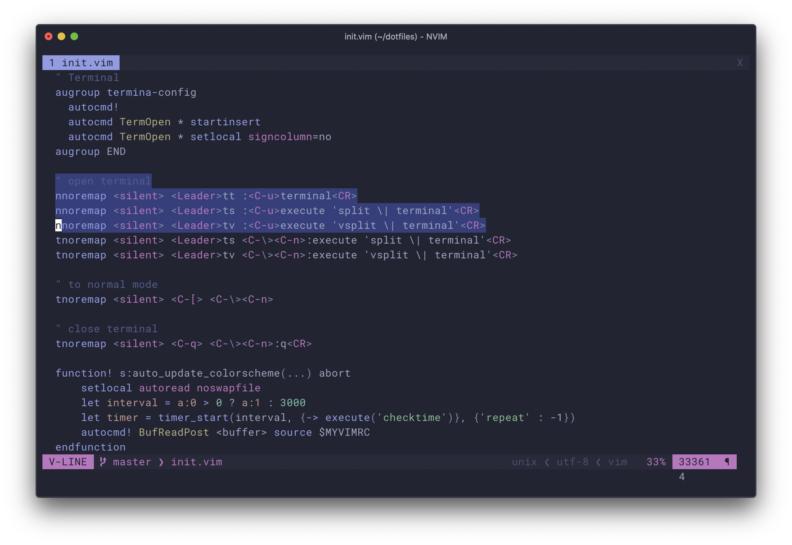

[](https://github.com/wadackel/vim-dogrun/actions)

> A dark Vim/Neovim colorscheme for the GUI and 16/256/true-color terminals.

## Gallery

### Neovim (GUI)



### Vim (with 256 colors)


## Features

- No configuration are required to start using it.
- Support 256 colors terminal.
- Supports [lightline.vim](https://github.com/itchyny/lightline.vim) theme.
- Loading speed in increased by precompiled script.

Check [here](#supported-filetypes-%26-plugins) for a list of supported file types and plugins :muscle:

## Installation

This is an example of installation using [vim-plug](https://github.com/junegunn/vim-plug).

```vim
Plug 'wadackel/vim-dogrun'
```

## Usage

Add the following settings to your `$MYVIMRC` (`.vimrc` or `init.vim`).

```vim
colorscheme dogrun
```

### Options

#### lightline theme

If you want, specify `dogrun` for` colorscheme`.

```vim
let g:lightline = {
  \ 'colorscheme': 'dogrun',
  \ }
```

## Supported Filetypes & Plugins

There are not many Ftypes and Plugins supported by `dogrun` yet.  
From now on, we will gradually support it :dog:

### Filetypes

- `diff`
- `html`
- `javascript`
- `make`
- `markdown` ([vim-markdown](https://github.com/tpope/vim-markdown))
- `typescript` ([yats.vim](https://github.com/HerringtonDarkholme/yats.vim))
- `vim`

### Plugins

- [ALE](https://github.com/dense-analysis/ale)
- [lightline.vim](https://github.com/itchyny/lightline.vim)
- [vim-gitgutter](https://github.com/airblade/vim-gitgutter)
- [clever-f.vim](https://github.com/rhysd/clever-f.vim)

## Inspired

Many thanks for the following projects:

- [vim-color-spring-night](https://github.com/rhysd/vim-color-spring-night)

## License

[MIT License © wadackel](./LICENSE)
